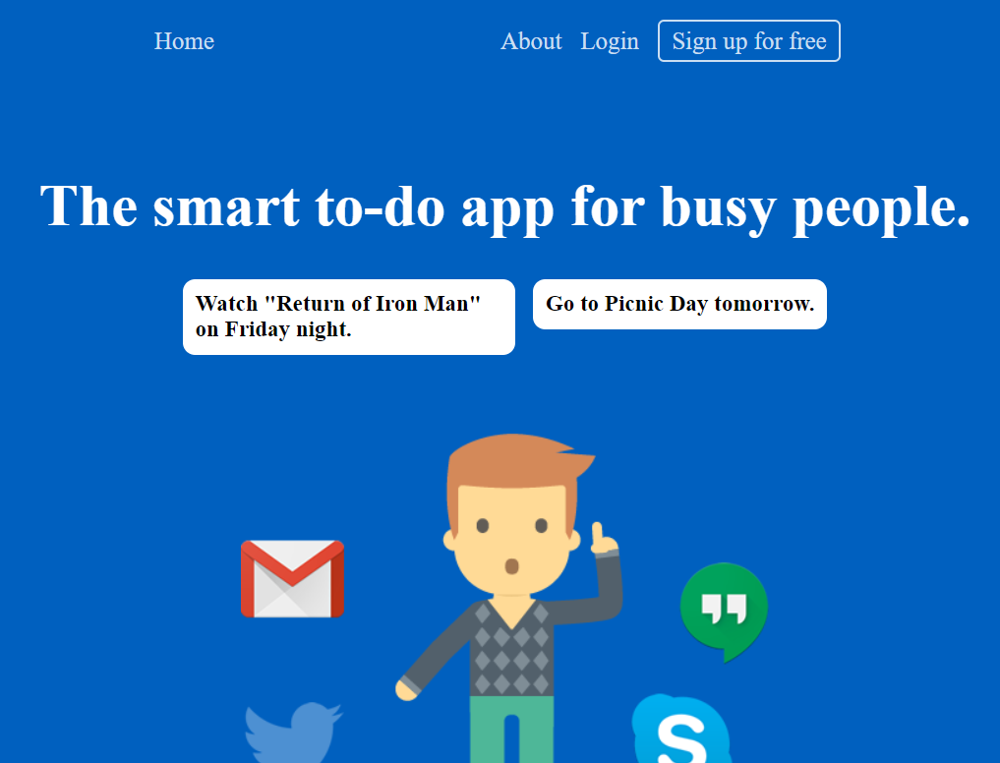

# Introdution
This website is a clone of Remember The Milk. You can view all task and all lists after login. Clicking on each task or list, you can view more details.
You can create/rename/update/delete lists and create/update/delete tasks.

# Technology

- React - An frontend library for building user interfaces.
- Redux - A predictable, centralized state container for JavaScript apps.
- Python - A programming language for building backend data manipulation.
- SQLAlchemy - A library that facilitates the communication between Python programs and databases
- Database: Development: SQLite3

# Screenshot of Project



# Set up
1. Clone this repository

2. Install dependencies for backend

      ```bash
      pipenv install -r requirements.txt
      ```

3. Create a **.env** file based on the example with proper settings for your
   development environment

4. Make sure the SQLite3 database connection URL is in the **.env** file

5. For `SCHEMA`, making sure you use the snake_case convention.
   For `SECRET_KEY`, put in your own serect key.

6. With pipenv, migrate your database, seed your database, and run your Flask app

   ```bash
   pipenv run flask db upgrade
   ```

   ```bash
   pipenv run flask seed all
   ```

   ```bash
   pipenv run flask run
   ```
7. In another terminal, cd into the ```react-app``` directory and install dependencies for React frontend

      ```bash
      npm install
      ```
8. Once all the installation for dependencies is completed, start the application
      ```bash
      npm start
      ```

# Project Developers
- Dongliang Li
- Sarah Moore
- Seng Wang
- Penny Wang
